# **SISTEMA PDV**

<p>É um sistema de ponto de vendas, onde o cliente consegue realizar cadastros de produtos, suas respectivas categorias, além de excluir ou atualizar esses registros, ações que só poderão ser realizadas por meio de um login de usuário autenticado, para preservar a segurança e integridade dos dados e das vendas realizadas.</p>


## **Índice**

* <a href="tecnologias">Tecnologias e ferramentas utilizadas</a>
* <a href="funcionalidades">Funcionalidades</a>
* <a href="demonstracao">Demonstração</a>
* <a href="testes">Testes realizados</a>
* <a href="autores">Autores</a>
____

## **Tecnologias e ferramentas utilizadas:**

* [Javascript](https://developer.mozilla.org/pt-BR/docs/web/javascript/guide/introduction)
* [Node.js](https://nodejs.org/docs/latest-v18.x/api/)
* [Express](https://expressjs.com/en/5x/api.html)
* [Nodemon](https://www.npmjs.com/package/nodemon)
* [Axios](https://www.npmjs.com/package/nodemon) 
* [Bcrypt](https://www.npmjs.com/package/bcrypt)
* [Cors](https://developer.mozilla.org/pt-BR/docs/Web/HTTP/CORS)
* [Dotenv](https://www.npmjs.com/package/dotenv)
* [Joi](https://www.npmjs.com/package/joi)
* [JsonWebToken](https://jwt.io/introduction)
* [Knex](https://www.npmjs.com/package/knex)
* [Pg](https://www.npmjs.com/package/pg)

___

## **Funcionalidades**

### Usuários
* [x] <a href="cadastro">Cadastrar usuário</a>
* [x] <a href="login">Login de usuário</a>
* [x] <a href="perfil">Buscar perfil do usuário</a>
* [x] <a href="atualizarUsuario">Atualizar usuário</a>

### Produtos
* [x] <a href="listarCategoria">Listar Categorias</a>
* [x] <a href="cadastrarProduto">Cadastrar Produto</a>
* [x] <a href="listarProdutos">Listar Produtos</a>
* [x] <a href="atualizarProduto">Atualizar Produto</a>
* [x] <a href="detalharProduto">Detalhar Produto por ID</a>
* [x] <a href="excluirProduto">Excluir Produto por ID</a>

### Clientes
* [x] <a href="cadastrarCliente">Cadastrar Cliente</a>
* [x] <a href="atualizarCliente">Atualizar Cliente</a>
* [x] <a href="listarClientes">Listar Clientes</a>
* [x] <a href="detalharCliente">Detalhar Cliente por ID</a>
___

## **Demonstração**
[Link deploy](https://pdv-hunters.cyclic.app)

___

## **Testes realizados**

### Cadastrar usuário

```bash

const cadastrarUsuario = async (req, res) => {
    const { nome, email, senha } = req.body
    try {
        const emailJaExiste = await knex('usuarios').where({ email }).first()
        if (emailJaExiste) {
            return res.status(400).json({ mensagem: 'Este email já está cadastrado.' })
        }
        const senhaCriptografada = await bcrypt.hash(senha, 10)

        const novoUsuario = await knex('usuarios').insert({
            nome,
            email,
            senha: senhaCriptografada
        }).returning(['nome', 'email'])

        if (!novoUsuario[0]) {
            return res.status(400).json({ mensagem: 'Não foi possível cadastrar o usuário, tente novamente.' })
        }

        return res.status(201).json(novoUsuario[0])
    } catch (error) {
        console.log(error);
        return res.status(500).json({
            mensagem: 'Erro interno do servidor.'
        })
    }

};
```
Sucesso:


Erro:
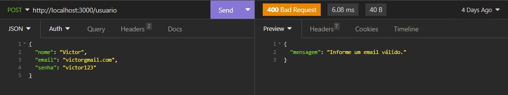

Banco de Dados:
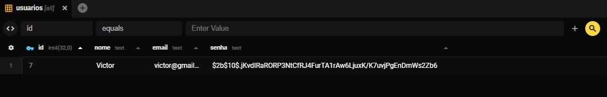

___

### Login de usuário

```bash
const loginUsuario = async (req, res) => {
    const {email, senha} = req.body;
    
    try {
        const usuario = await knex('usuarios').where({ email }).first()
        
        
        if(!usuario){
            return res.status(400).json({
                mensagem: 'Email ou senha inválido.'
            })
        }

        const senhaValida = await bcrypt.compare(senha, usuario.senha);

        if(!senhaValida){
            return res.status(400).json({
                mensagem: 'Email ou senha inválido.'
            })
        }

        const token = jwt.sign({id: usuario.id}, process.env.JWT_SENHA, {expiresIn: '8h'})

        const {senha: _, ...usuarioLogado} = usuario
        
        return res.json({
            usuario: usuarioLogado, token
        })
    } catch (error) {
        console.log(error)
        return res.status(500)
        .json({
            mensagem: 'Erro interno do servidor.'
        })
        
    }
};
```
Sucesso:


Erro:
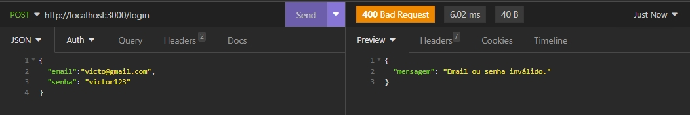
___

### Buscar perfil do usuário

```bash 
const detalharPerfilUsuarioLogado = async (req, res) => {
    return res.json(req.usuario);
}
```
Sucesso:


Erro:
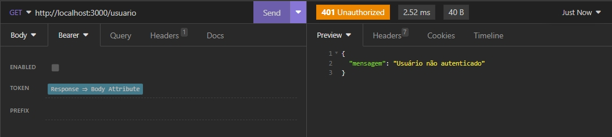
___

### Atualizar usuário

```bash 
const editarUsuario = async (req, res) => {
    const { nome, email, senha } = req.body
    const { id } = req.usuario

    try {
        const emailJaExiste = await knex('usuarios').where({ email }).andWhere('id', '!=', id).first()

        if (emailJaExiste) {
            return res.status(400).json({ mensagem: "Este email ja existe no banco de dados" })
        }

        const senhaCriptografada = await bcrypt.hash(senha, 10)

        const usuarioEditado = await knex('usuarios').update({ nome, email, senha: senhaCriptografada }).where({id}).returning(['id', 'nome', 'email'])

        if (!usuarioEditado[0]) {
            return res.status(400).json({ mensagem: "Não foi possível atualizar o usuário" })
        }

        return res.status(200).json({ atuliazadoComSucesso: usuarioEditado[0] })

    }

    catch (error) {
        console.log(error)
        return res.status(500).json({ mensagem: "Erro interno do servidor" })
    }
}
```
Sucesso:


Erro:


Banco de dados:

___

### Listar categorias

```bash 
const listarCategorias = async (req, res) => {

  try {
    const categorias = await knex('categorias')

    if (!categorias) {
      return res.status(404).json({ mensagem: 'Categorias nao encontradas' })
    }
    
    return res.status(200).json(categorias) 
  } catch(error) {
    console.log(error)
    return res.status(500).json({ mensagem: 'Erro interno do servidor' })
  }
}
```
Sucesso:
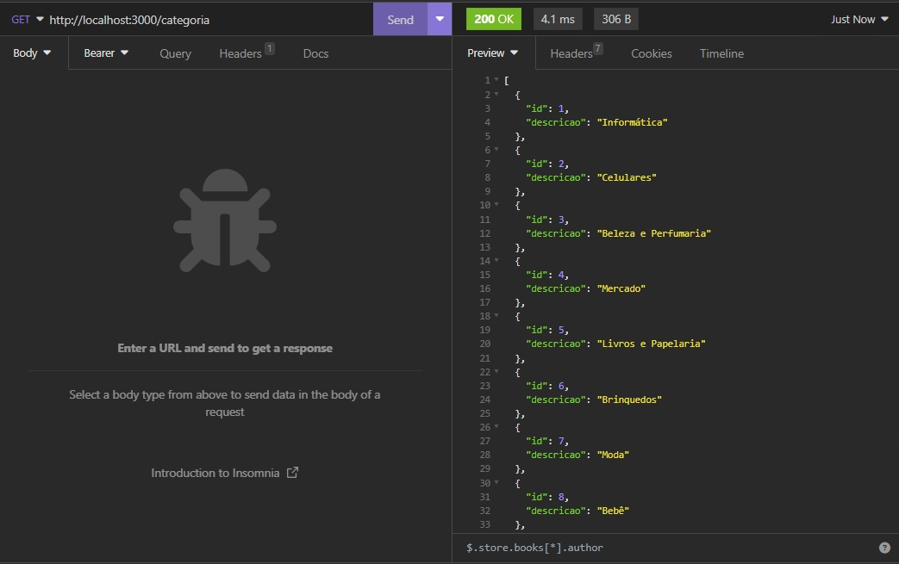

Banco de dados:
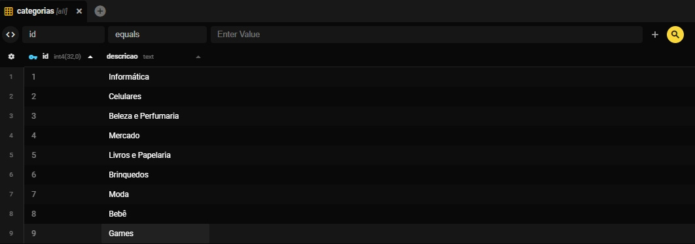
___

### Cadastrar produto

```bash 
const cadastrarProduto = async (req, res) => {
    const { descricao, quantidade_estoque, valor, categoria_id } = req.body
    try {
        const categoria = await knex('categorias').where({ id: categoria_id }).first()

        if (!categoria) {
            return res.status(404).json({ mensagem: 'Não foi possível encontrar a categoria informada.' })
        }

        const produtoJaExiste = await knex('produtos').where({ descricao }).first()
        if (produtoJaExiste) {
            return res.status(400).json({ mensagem: 'Este produto já está cadastrado no banco de dados.' })
        }

        const novoProduto = await knex('produtos').insert({
            descricao,
            quantidade_estoque,
            valor,
            categoria_id
        }).returning('*')

        if (!novoProduto) {
            return res.status(400).json({ mensagem: 'Não foi possível cadastrar o produto.' })
        }

        return res.json({ novoProduto: novoProduto[0] })

    } catch (error) {
        console.log(error);
        return res.status(500).json({
            mensagem: 'Erro interno do servidor.'
        })
    }
}
```
Sucesso:
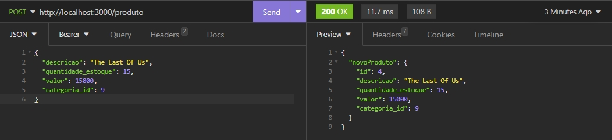

Erro:
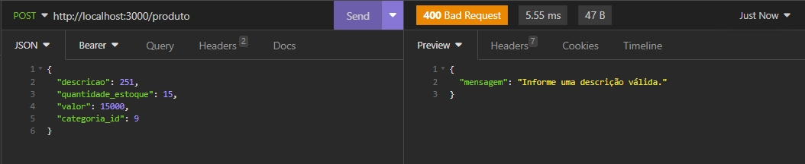

Banco de dados:
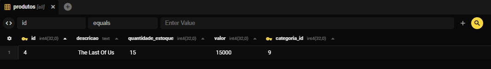
___

### Listar produtos

```bash 
const listarProdutos = async (req, res) => {
    const { categoria_id } = req.query
    try {
        if (categoria_id) {
            const categoria = await knex('categorias').where({ id: categoria_id }).first()

            if (!categoria) {
                return res.status(404).json({ mensagem: 'Não foi possível encontrar a categoria informada.' })
            }

            const produtos = await knex('produtos').where({ categoria_id }).orderBy("id")
            if (produtos.length < 1) {
                return res.status(404).json({ mensagem: 'Não foi possível encontrar produtos utilizando a categoria informada.' })
            }
            return res.json(produtos)
        }
        const produtos = await knex('produtos').orderBy("id")
        console.log(produtos);
        return res.json(produtos)

    } catch (error) {
        console.log(error);
        return res.status(500).json({
            mensagem: 'Erro interno do servidor.'
        })
    }
}
```
Sucesso:
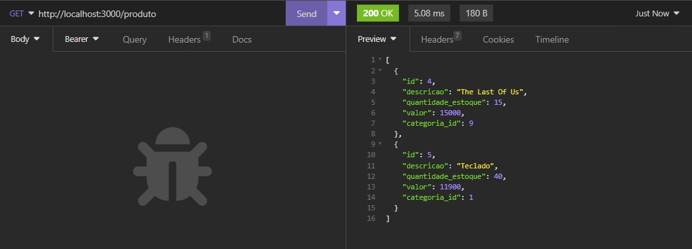

Erro:
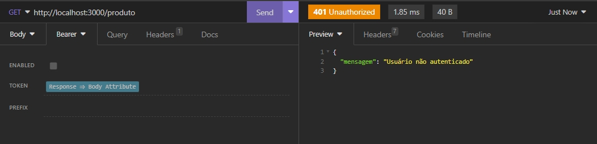

Banco de dados:
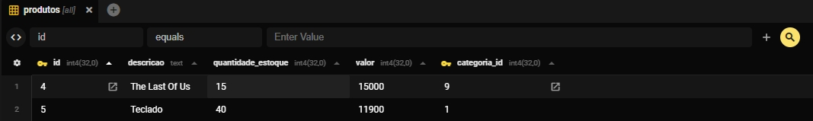

___

### Atualizar produto


```bash 
const editarProduto = async (req, res) => {
    const { descricao, quantidade_estoque, valor, categoria_id } = req.body
    const { id } = req.params

    try {
        const produto = await knex('produtos').where({ id }).first()

        if (!produto) {
            return res.status(404).json({ mensagem: 'Não foi possível encontrar o produto.' })
        }

        const categoria = await knex('categorias').where({ id: categoria_id }).first()

        if (!categoria) {
            return res.status(404).json({ mensagem: 'Não foi possível encontrar a categoria informada.' })
        }

        const produtoJaExiste = await knex('produtos').where({ descricao }).andWhere('id', '!=', id).first()

        if (produtoJaExiste) {
            return res.status(400).json({ mensagem: 'Este produto já está cadastrado no banco de dados.' })
        }

        const produtoAtualizado = await knex('produtos').update({
            descricao,
            quantidade_estoque,
            valor,
            categoria_id
        }).where({ id }).returning('*')

        if (!produtoAtualizado) {
            return res.status(400).json({ mensagem: 'Não foi possível atualizar o produto.' })
        }

        return res.json({ produtoAtualizado: produtoAtualizado[0] })

    } catch (error) {
        console.log(error);
        return res.status(500).json({
            mensagem: 'Erro interno do servidor.'
        })
    }
}

```
Sucesso:
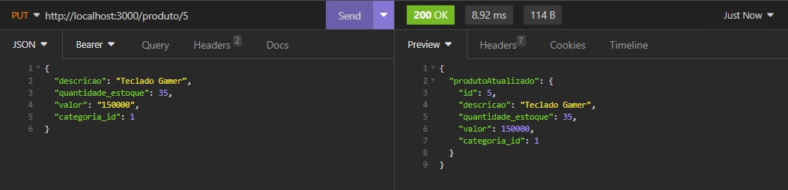

Erro:
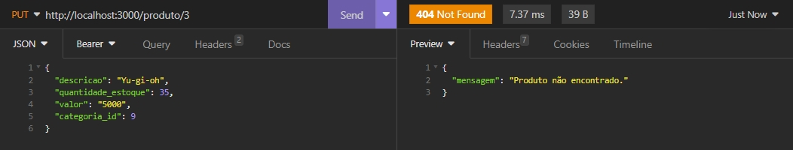

Banco de dados:
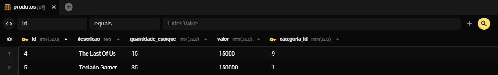

___

### Detalhar Produto por ID
```bash 
    const detalharProduto = async (req, res) => {
    const { id } = req.params

    try {
        const produto = await knex('produtos').where({ id }).first()

        if (!produto) {
            return res.status(404).json({ mensagem: `Produto não foi encontrado.` })
        }

        return res.status(200).json(produto)
    } catch (error) {
        console.log(error)
        return res.status(404).json({ mensagem: "Erro interno do servidor." })
    }
}
```
Sucesso:
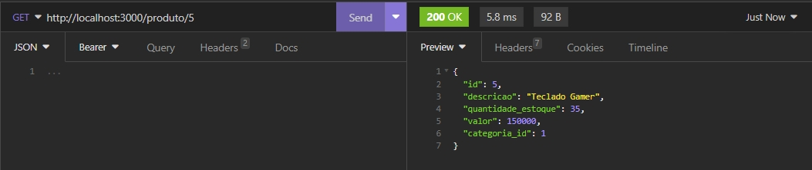

Erro:
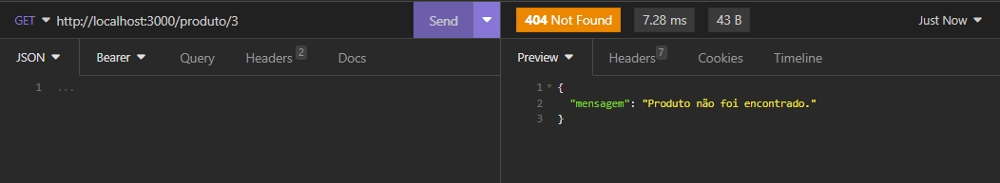

___

### Excluir produto por ID
```bash 
    const excluirProduto = async (req, res) => {
    const { id } = req.params

    try {
        const produtoDeletar = await knex('produtos').where({ id }).first()

        if (!produtoDeletar) {
            return res.status(404).json({ mensagem: `Produto não foi encontrado.` })
        }

        await knex('produtos').where({ id }).del()

        return res.status(201).json({ produtoExcluido: produtoDeletar })
    } catch (error) {
        console.log(error)
        return res.status(200).json({ mensagem: "Erro interno do servidor" })
    }
}
```
Sucesso:
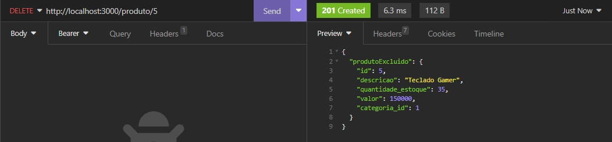

Erro:
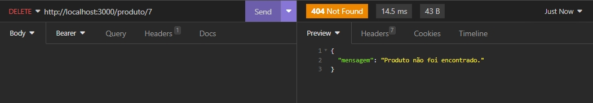

Banco de dados:
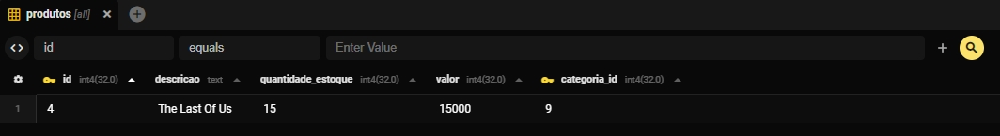
___

### Cadastrar Cliente

```bash 
    const cadastrarCliente = async (req, res) => {
  const { nome, email, cpf, cep, rua, numero, bairro, cidade, estado } = req.body

  try {
    const emailJaExiste = await knex('clientes').where({ email }).first()

    if (emailJaExiste) {
      return res.status(400).json({ mensagem: "Email já cadastrado." })
    }

    const cpfJaExiste = await knex('clientes').where({ cpf }).first()

    if (cpfJaExiste) {
      return res.status(400).json({ mensagem: "CPF já cadastrado." })
    }

    const novoCliente = {
      nome,
      email,
      cpf,
      cep,
      rua, 
      numero,
      bairro,
      cidade,
      estado
    }

    await knex('clientes').insert(novoCliente)

    return res.status(200).json({ novoCliente })

  } catch (error) {
    return res.status(500).json({ mensagem: "Erro interno do servidor." })
  }
};
```
Sucesso:
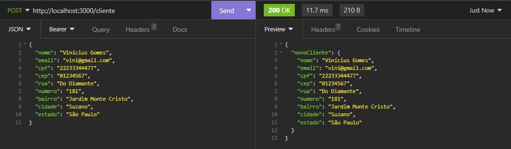

Erro:
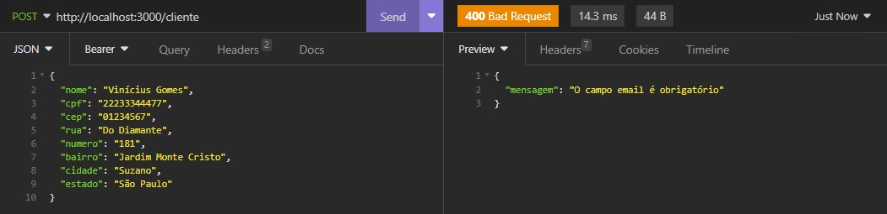

Banco de dados:
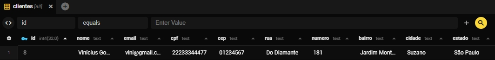

___

### Atualizar Cliente
```bash 
    const editarCliente = async (req, res) => {
  const {nome, email, cpf, cep, rua, numero, bairro, cidade, estado} = req.body;
  const {id} = req.params;

  try {
    const cliente = await knex('clientes').where({ id }).first()

    if(!cliente){
      return res.status(404).json({ mensagem: 'Cliente não encontrado.' })
    }

    const cpfJaExiste = await knex('clientes').where({cpf}).whereNot('id',id).first()
    const emailJaExiste = await knex('clientes').where({email}).whereNot('id',id).first()

    if(cpfJaExiste){
      return res.status(400).json({ mensagem: 'CPF já está cadastrado.' })
    }

    if(emailJaExiste){
      return res.status(400).json({ mensagem: 'Email já está cadastrado.' })
    }

    const clienteAtualizado = await knex('clientes').update({
      nome,
      email,
      cpf,
      cep,
      rua,
      numero,
      bairro,
      cidade,
      estado
    }).where({id}).returning('*')

    return res.json({clienteAtualizado: clienteAtualizado[0]})

  } catch (error) {
    return res.status(500).json({ mensagem: "Erro interno do servidor." })
  }
};
```
Sucesso:
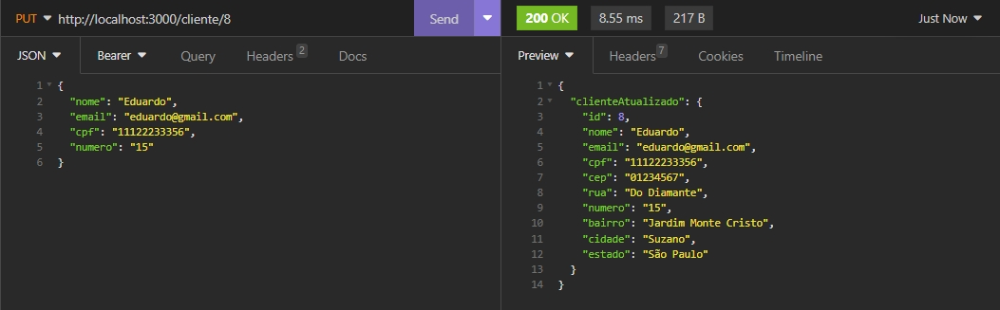

Erro:
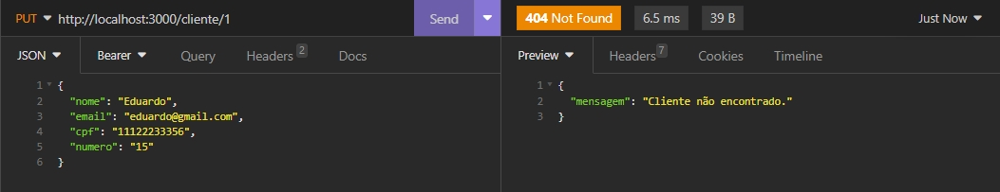

Banco de dados:
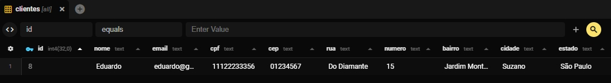
___

### Listar Clientes
```bash 
    const listarClientes = async (req, res) => {
  
  try {
    const clientes = await knex('clientes')
    
    if(!clientes){
      return res.status(404).json({ mensagem: 'Cliente(s) nao encontrado(s).' })
    }

    return res.json(clientes)
  } catch (error) {
    return res.status(500).json({ mensagem: 'Erro interno do servidor.' })
  }

};
```
Sucesso:
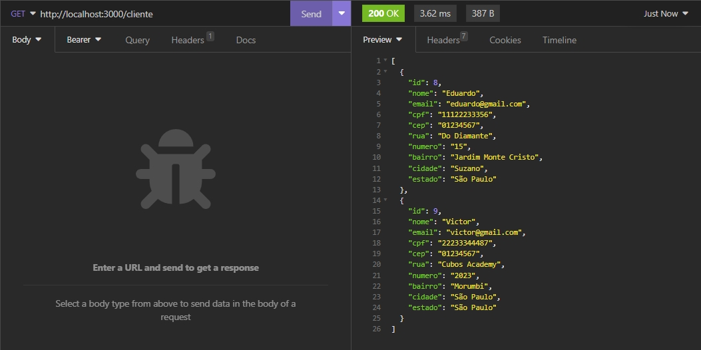

Erro:
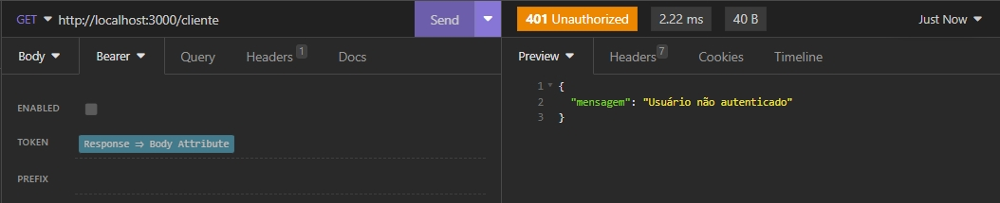

Banco de dados:
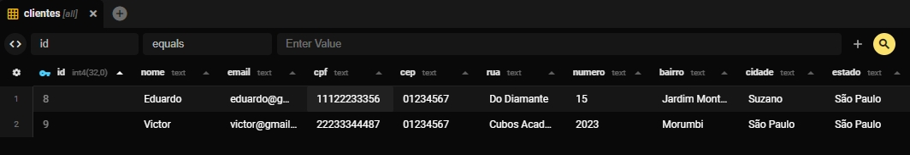
___

### Detalhar Cliente por ID
```bash 
    const detalharCliente = async (req, res) => {
  const {id} = req.params;

  try {
    const cliente = await knex('clientes').where({ id }).first()

    if(!cliente){
      return res.status(404).json({mensagem: 'Cliente não encontrado.'})
    }

    return res.json(cliente)
    
  } catch (error) {
    return res.status(500).json({ mensagem: "Erro interno do servidor." })
  }
};
```
Sucesso:
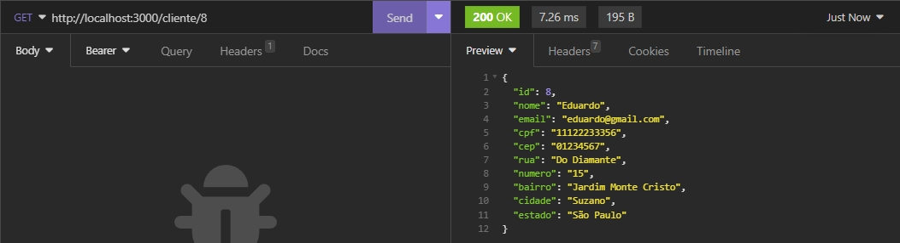

Erro:
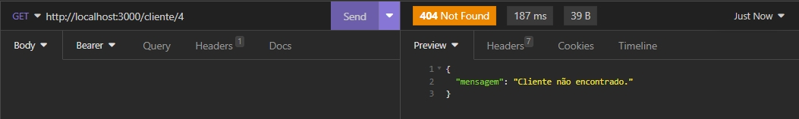
___

## **Autores**

<div style="display: flex; justify-content: space-around;">

  <div style="text-align: center;">
    
    <br>
    <a href="https://www.linkedin.com/in/igor-padua/">Igor André</a>
  </div>

  <div style="text-align: center;">
    
    <br>
    <a href="https://www.linkedin.com/in/helingston/">Helingston Pereira</a>
  </div>

  <div style="text-align: center;">
    
    <br>
    <a href="https://www.linkedin.com/in/michael-vpcruz/">Michael Cruz</a>
  </div>

  <div style="text-align: center;">
    
    <br>
    <a href="https://www.linkedin.com/in/victor-freitas-5986a333/">Victor Freitas</a>
  </div>

  <div style="text-align: center;">
    
    <br>
    <a href="https://www.linkedin.com/in/vini-gomes/">Vinícius Gomes</a>
  </div>

</div>


