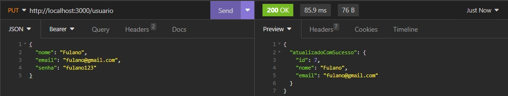

# **SISTEMA PDV**

<p>É um sistema de ponto de vendas, onde o cliente consegue realizar cadastros de produtos, suas respectivas categorias, além de excluir ou atualizar esses registros, ações que só poderão ser realizadas por meio de um login de usuário autenticado, para preservar a segurança e integridade dos dados e das vendas realizadas.</p>


## **Índice**

* <a href="tecnologias">Tecnologias e ferramentas utilizadas</a>
* <a href="funcionalidades">Funcionalidades</a>
* <a href="demonstracao">Demonstração</a>
* <a href="testes">Testes realizados</a>
* <a href="autores">Autores</a>
____

## **Tecnologias e ferramentas utilizadas:**

* [Javascript](https://developer.mozilla.org/pt-BR/docs/web/javascript/guide/introduction)
* [Node.js](https://nodejs.org/docs/latest-v18.x/api/)
* [Express](https://expressjs.com/en/5x/api.html)
* [Nodemon](https://www.npmjs.com/package/nodemon)
* [Axios](https://www.npmjs.com/package/nodemon) 
* [Bcrypt](https://www.npmjs.com/package/bcrypt)
* [Cors](https://developer.mozilla.org/pt-BR/docs/Web/HTTP/CORS)
* [Dotenv](https://www.npmjs.com/package/dotenv)
* [Joi](https://www.npmjs.com/package/joi)
* [JsonWebToken](https://jwt.io/introduction)
* [Knex](https://www.npmjs.com/package/knex)
* [Pg](https://www.npmjs.com/package/pg)

___

## **Funcionalidades**

* [x] <a href="cadastro">Cadastrar usuário</a>
* [x] <a href="login">Login de usuário</a>
* [x] <a href="perfil">Buscar perfil do usuário</a>
* [x] <a href="atualizar">Atualizar usuário</a>
* [x] <a href= "listarCategoria">Listar categorias</a>
___

## **Demonstração**
[Link deploy]()

__

## **Testes realizados**

### Cadastrar usuário

```bash

const cadastrarUsuario = async (req, res) => {
    const { nome, email, senha } = req.body
    try {
        const emailJaExiste = await knex('usuarios').where({ email }).first()
        if (emailJaExiste) {
            return res.status(400).json({ mensagem: 'Este email já está cadastrado.' })
        }
        const senhaCriptografada = await bcrypt.hash(senha, 10)

        const novoUsuario = await knex('usuarios').insert({
            nome,
            email,
            senha: senhaCriptografada
        }).returning('*')

        if (!novoUsuario) {
            return res.status(400).json({ mensagem: 'Não foi possível cadastrar o usuário, tente novamente.' })
        }

        const { senha: _, ...dadosUsuario } = novoUsuario[0]

        return res.status(201).json(dadosUsuario)
    } catch (error) {
        console.log(error);
        return res.status(500).json({
            mensagem: 'Erro interno do servidor.'
        })
    }

};
```
Sucesso:


Erro:

___

### Login de usuário

```bash
const loginUsuario = async (req, res) => {
    const {email, senha} = req.body;
    
    try {
        const usuario = await knex('usuarios').where({ email }).first()
        
        
        if(!usuario){
            return res.status(400).json({
                mensagem: 'Email ou senha inválido.'
            })
        }

        const senhaValida = await bcrypt.compare(senha, usuario.senha);

        if(!senhaValida){
            return res.status(400).json({
                mensagem: 'Email ou senha inválido.'
            })
        }

        const token = jwt.sign({id: usuario.id}, process.env.JWT_SENHA, {expiresIn: '8h'})

        const {senha: _, ...usuarioLogado} = usuario
        
        return res.json({
            usuario: usuarioLogado, token
        })
    } catch (error) {
        console.log(error)
        return res.status(500)
        .json({
            mensagem: 'Erro interno do servidor.'
        })
        
    }
};
```
Sucesso:


Erro:

___

### Buscar perfil do usuário

```bash 
const detalharPerfilUsuarioLogado = async (req, res) => {
    return res.json(req.usuario);
}
```
Sucesso:


Erro:

___

### Atualizar usuário

```bash 
const editarUsuario = async (req, res) => {
    const { nome, email, senha } = req.body
    const { id } = req.usuario

    try {
        const emailJaExiste = await knex('usuarios').where({ email }).andWhere('id', '!=', id).first()

        if (emailJaExiste) {
            return res.status(400).json({ mensagem: "Este email ja existe no banco de dados" })
        }

        const senhaCriptografada = await bcrypt.hash(senha, 10)

        const usuarioEditado = await knex('usuarios').update({ nome, email, senha: senhaCriptografada }).where({id}).returning(['id', 'nome', 'email'])

        if (!usuarioEditado[0]) {
            return res.status(400).json({ mensagem: "Não foi possível atualizar o usuário" })
        }

        return res.status(200).json({ atuliazadoComSucesso: usuarioEditado[0] })

    }

    catch (error) {
        console.log(error)
        return res.status(500).json({ mensagem: "Erro interno do servidor" })
    }
}
```
Sucesso:


Erro:


___

### Listar categorias

```bash 
const listarCategorias = async (req, res) => {

  try {
    const categorias = await knex('categorias')

    if (!categorias) {
      return res.status(404).json({ mensagem: 'Categorias nao encontradas' })
    }
    
    return res.status(200).json(categorias) 
  } catch(error) {
    console.log(error)
    return res.status(500).json({ mensagem: 'Erro interno do servidor' })
  }
}
```
Sucesso:


Erro:

___

## **Autores**
- [Igor André](https://www.linkedin.com/in/igor-padua/)
- [Helingston Pereira](https://www.linkedin.com/in/helingston/)
- [Michael Cruz](https://www.linkedin.com/in/michael-vpcruz/)
- [Victor Freitas](https://www.linkedin.com/in/victor-freitas-5986a333/)
- [Vinícius Gomes](https://www.linkedin.com/in/vini-gomes/)

